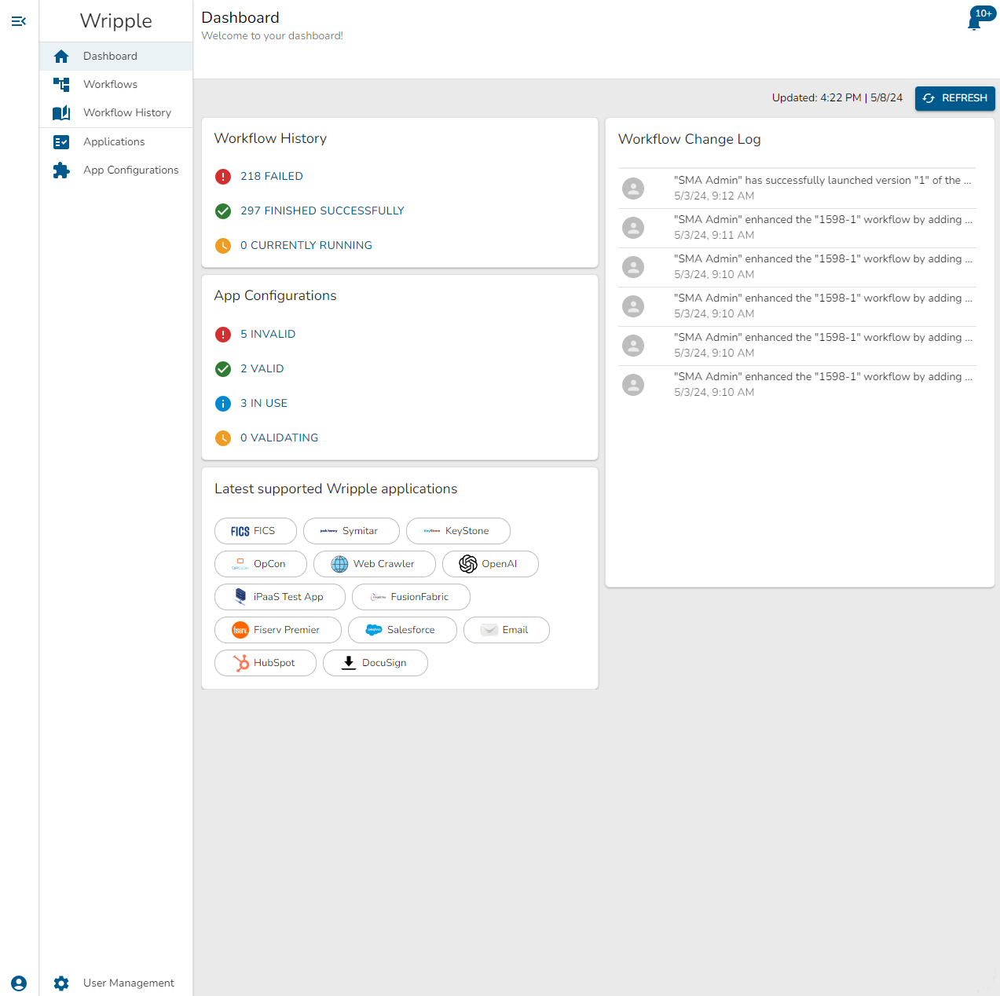
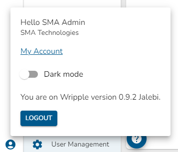
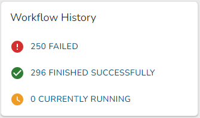
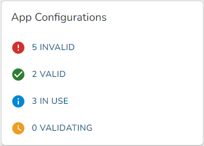
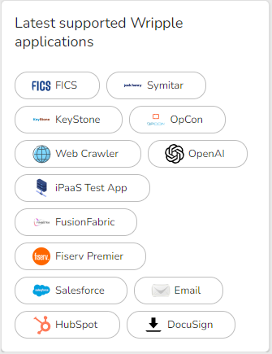
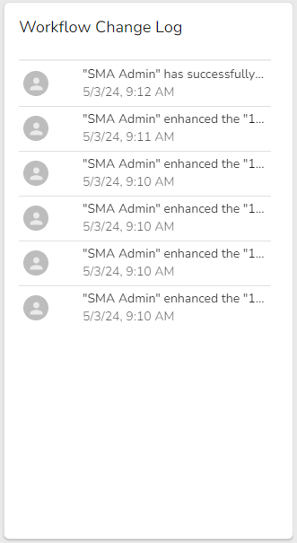

# Overview

The Dashboard is where you can see an overview of your Wripple instance at a glance. You can see an example dashboard below:

## Navigation Sidebar

You can find the Navigation Sidebar on the left-hand side of the screen.
On larger screens, this panel is collapsible and can be opened or closed with the upper-most 'menu' button.
Beneath this button you can find the navigation menu which you can use to get around Wripple.
In order, you will see:

1. Dashboard (You Are Here)
2. [Workflows](../05-workflows/workflows.md) - view, add, and configure your automation workflows
3. [Workflow History](../06-workflow-history/01-execution.md) - view details of past workflow executions and changes
4. Applications - view details for all of the applications which Wripple enables you to automate
5. [App Configurations](../04-app-configurations/01-intro.md) - view, add, and configure your connections to supported applications

At the bottom of the navigation sidebar, you will also see a "person" button for your "My Account" view and a "cog" button which will navigate to your User Management screen.
For more information on User Management, see the [SSO Configuration](../07-setup/sso-configuration.md) documentation.
:::info

You require advanced permissions to see and configure user management in Wripple. If you do not have these permissions, you will not see this menu option.

:::

### My Account

The "My Account" menu is where you can quickly access frequently-used account actions. An example of this view is shown below:

In this menu, you can see:

1. Your user name
1. Your company name
1. A link to your complete account settings configuration
1. A toggle to change the theme of Wripple between light mode and dark mode
1. A Wripple version indicator
1. A 'Logout' button which will end your session

## Dashboard Widgets

The Dashboard is populated with a number of "widgets" which provide at-a-glance insights into the status of your Wripple instance. They can be found in the center area of the Dashboard screen. You can `Refresh` the contents of these widgets using the button at the upper right corner of the screen.

### Workflow History

The Workflow History widget shows an overview of the health of your published workflows. An example can be seen below:

This card displays:

1. The number of failed workflow executions
2. The number of successful workflow executions
3. The number of currently executing workflows

### App Configurations

The App Configurations widget shows an overview of the health of your App Configurations. An example can be seen below:

This card displays:

1. The number of app configurations which are invalid and cannot be used in a published workflow
2. The number of app configurations which are valid and can be used in a published workflow
3. The number of app configurations which are currently used in any workflow, published or unpublished
4. The number of app configurations which are currently being validated (these cannot be used in a published workflow until they have passed validation)

### Latest Apps

The Latest Apps widget shows a selection of the newest apps that Wripple supports. An example view can be seen below:

Go to the [App Configurations](../04-app-configurations/01-intro.md) screen to configure these apps for use in your workflows!

### Workflow Change Log

The Workflow Change Log widget shows the most recent workflow changes which have been made by users in your organization. An example view can be seen below:

You can go to the [Workflow History](../06-workflow-history/01-execution.md) screen to see more details on these changes.
