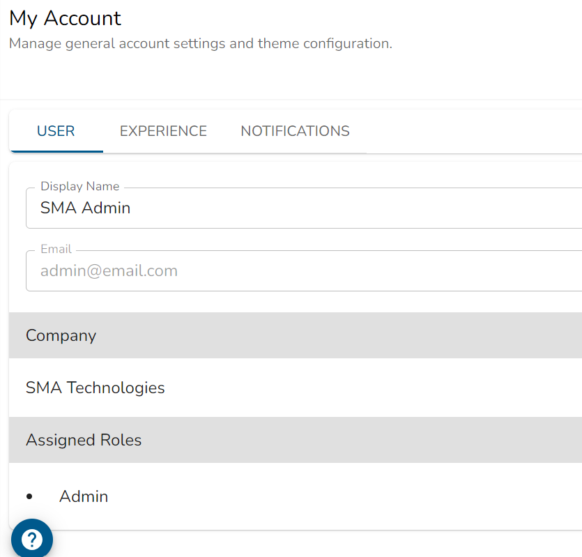
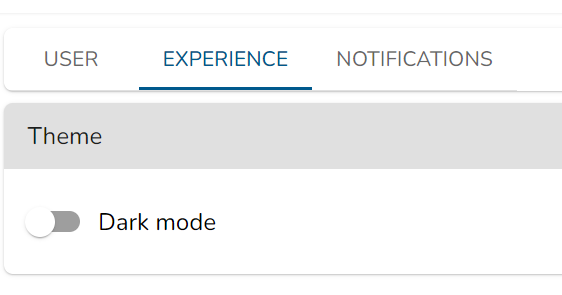
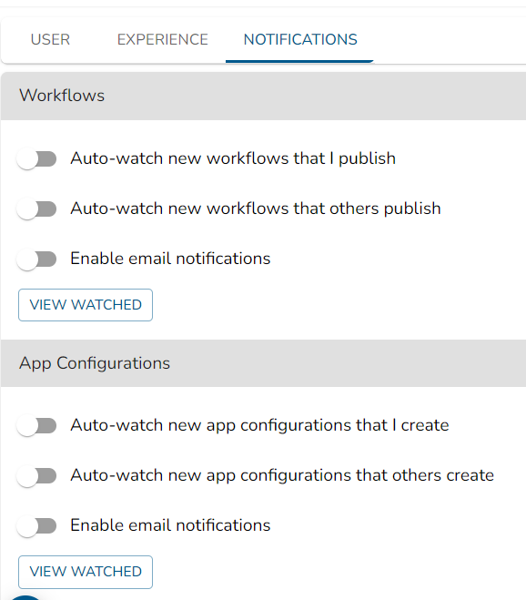

# My Account Overview

This document provides details for managing account settings and configurations.

## User Tab

The **User** tab allows you to manage basic account information like display name, email, and assigned roles.

1. **Display Name:** The display name of the user, which will appear in the UI.

   - Example: SMA Admin

2. **Email:** The email address associated with the account.

   - Example: admin@email.com

3. **Company:** The company to which this user belongs.

   - Example: SMA Technologies

4. **Assigned Roles:** The roles assigned to the user, granting specific access and permissions.
   - Example: Admin

## Experience Tab

1. **Theme:** Allows toggling between different themes for the user interface.
   - **Dark mode:** Toggle this switch to enable or disable dark mode.

## Notifications Tab

The **Notifications** tab allows you to set notification preferences for various alerts and updates.

### Workflows

1. **Auto-watch new workflows that I publish:** Toggle this switch to automatically monitor new workflows you publish.
2. **Auto-watch new workflows that others publish:** Enable automatic monitoring of new workflows published by other users.
3. **Enable email notifications:** Receive email alerts for workflow updates.
4. **View Watched:** View workflows you are currently watching.

### App Configurations

1. **Auto-watch new app configurations that I create:** Toggle this switch to automatically monitor new app configurations you create.
2. **Auto-watch new app configurations that others create:** Enable automatic monitoring of new app configurations made by others.
3. **Enable email notifications:** Receive alerts via email for app configuration updates.
4. **View Watched:** View the list of app configurations currently being monitored.
