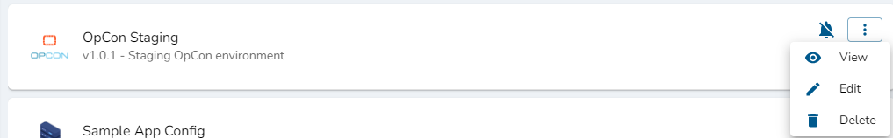

# Overview
## Required Privileges
In order to access the App Configurations page, you must have one of the following roles:

- **Reader**: User can view existing App Configurations.
- **Editor**: User can view, create, edit, and delete their own App Configurations.
- **Admin**: User can view, create, edit, and delete App Configurations.

## About
Some applications which Wripple can integrate with require advanced configuration, often in the form of providing credentials such as username and password, which Wripple will use to communicate with the application.
This configuration information is an **App Configuration**. When creating a step in a workflow which depends on an application (such as a Trigger or Action), you must specify the App Configuration which will be used when that step is executed.

You can have multiple configurations for the same application, such as one configuration to access a production environment and another to access a staging environment.

## Viewing App Configurations
The App Configurations screen displays a list of all of your existing App Configurations; each App Configuration is given its own card on this screen. Below, you can see an example view of this screen which demonstrates a few sample App Configurations. Notice the top header bar which allows you to search for, filter, and alphabetically order your App Configurations.

:::tip What's on an App Configuration Card?

- App Configuration name
- App Configuration description
- Notification status
- Icons indicating the status of the App Configuration
- App Configuration menu button
  :::

### App Configuration Status
An App Configuration can be in one of four statuses:
1. Valid
2. Invalid
3. Validating
4. Draft (a special case for the 'Invalid' status)

When an App Configuration is created, Wripple will perform server-side validation on the configuration to ensure that it can be successfully utilized to communicate with the applicable application.

:::warning

To publish a workflow, all App Configurations which are used by that workflow must have a Valid status.

:::

:::tip For Example:

You want to allow Wripple to send and monitor emails with your Gmail account.
To do so, you create an App Configuration for the "Email" application using the "Gmail" option and provide the necessary user credentials.
After saving this configuration, Wripple will test those credentials on the server to ensure that it can authenticate with Gmail using the provided email and password.
If you have, then the configuration will be marked as "Valid" and it can be safely used in a workflow.
Or, if you have provided some incorrect information (such as mistyping the password for the email account), then the configuration will be marked "Invalid".

:::

### Advanced App Configuration
Because Wripple runs in the cloud, any applications which it integrates with must be publically accessible from the cloud.
Sometimes, however, this is not possible because you wish to integrate with an application which runs on your private internal network.
In this case, you must utilize the Wripple Relay "Agent" to facilitate communication between Wripple in the cloud and your internal application.
Read more about this on the [Wripple Relay](./relay) page.

#### The "Draft" Status
When you run an application which is configured using Relay, Wripple must first establish communication with your Relay agent before it can validate the App Configuration.
If Wripple is unable to do so (there could be a number of potential causes, such as network outages, improper firewall configurations, or simply that the Agent is not running), then it cannot determine the validity of the configuration. In this case, the App Configuration will
enter the "Draft" status, a special case of the "Invalid" status. An example depicting an App Configuration in the "Draft" status can be seen below.

## The App Configuration Menu
Selecting the vertical ellipses on the right-hand side of an App Configuration card will open the App Configuration menu for that App Configuration; an example is shown below.

This menu allows you to take three actions:
1. View - This will open the App Configuration in read-only mode - no modifications can be made.
2. Edit - This will open the App Configuration. This action is only available to **Admins** or **Editors** (as long as the **Editor** is also the owner of the given App Configuration). In this view, you are allowed to make changes to the App Configuration.
3. Delete - This will permanently remove the App Configuration. This action is only available to **Admins** or **Editors** (as long as the **Editor** is also the owner of the given App Configuration).
