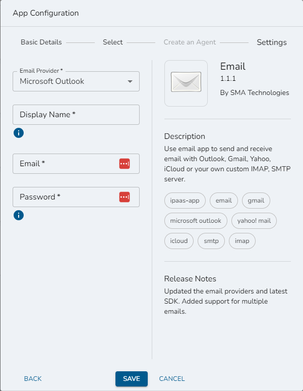

# Configuring an App
## Required Privileges
In order to create an App Configuration, you must have one of the following roles:

- **Editor**: User can view, create, edit, and delete their own App Configurations. They can also view and select existing Agents which the Configuration will run on in "on-prem" mode.
- **Admin**: User can view, create, edit, and delete App Configurations. They can also either choose an existing Agent or create a new Agent which the Configuration will run on in "on-prem" mode.

In order to create an App Configuration which takes advantage of Wripple Relay, you must also have one of the following roles:

- **Editor**: User can view and select existing Agents which the Configuration will run on.
- **Admin**: In addition to the above, the user can create new Agents for the Configuration to run on.

## Create a new App Configuration
In order to create a new App Configuration:
1. Navigate to the App Configurations screen
2. Select the "Create" button located in the upper-right corner of the screen.

This will open the "App Configuration" dialog which is discussed further [here](#app-config-dialog).

## Edit an existing App Configuration
In order to edit an existing App Configuration:
1. Navigate to the App Configurations screen
2. Find the card for the App Configuration you wish to modify
3. Select the vertical ellipses on the right-hand side of the card to open the App Configuration menu as seen below
4. Select the "Edit" action.

## The App Config Dialog {#app-config-dialog}
When you open the App Configuration Dialog, you will see the following:

There are a maximum of four steps required to create a new App Configuration - they are displayed across the top of the dialog and are:
1. Basic Details
2. Select an Agent
3. Create an Agent
4. Settings

:::info

The 'select' and 'create' steps are only required if you are creating an App Configuration for an application which is running "on-prem" (on your local private network) and are required for Wripple to be able to communicate with your Wripple Relay Agent. For more information on this topic, see the [Wripple Relay](./relay) page.

:::

### Basic Details
The first step in creating an App Configuration is entering some standard information which is required for any App Configuration.
Provide a name and a short description which will help you identify this configuration in the future, then select the Application which you would like to configure.
If you want to utilize a version of that Application which is not the latest, you can choose a different version from the `Version` drop-down field.

If you plan on configuring this app to run on-prem, turn the slider near the bottom of this form `On`. Some applications do not support being run on-prem, however, and this slider will be disabled when configuring those.

:::warning Agent Permissions

When you're getting started with running your first App Configuration in 'on-prem' mode, you'll need to create a new Agent which it will run on. This requires enhanced permissions. The 'on-prem' toggle will be disabled if you lack these.

:::

### Select an Agent
If you have activated 'on-prem' mode and you already have created at least one Agent, your next step will be to select the Agent which your new App Configuration will utilize. If you've activated 'on-prem' mode but do *not* have any existing Agents, you will instead be automatically directed to the 'Create an Agent' step.

On this screen, you can choose to either use an existing Agent or create a new Agent. If you want to use an existing Agent, select it from the `Choose an Agent` drop-down menu and then select the `Next` button to move on to the next step. If you prefer to create a new Agent instead, selecting the corresponding `Create An Agent` button will direct you to the 'Create An Agent' step. Please note that this action requires advanced permissions - if you lack them, this button will be disabled.

:::tip When to Create an Agent

You can utilize one Agent for any number of App Configurations, even across multiple applications. Instead, you should create one Agent for every independent private network which you need to allow Wripple to communicate with.
For a more thorough discussion of the use-case for a Wripple Relay Agent, see the [Wripple Relay](./relay) documentation.

:::

### Create an Agent
If you have activated 'on-prem' mode but you have never created any Agents, or if you have but have chosen to create a new Agent, you will be directed to the 'Create an Agent' step.

On this screen, you can choose the platform and architecture of the Agent which you will download and set up. Today, the only option is Windows x64, with more options being planned in the near future. Once you select the combination which you want, the installer package will be downloaded as a compressed file. See the `README.txt` file contained within the installer archive and the [Wripple Relay](./relay) documentation for more information on how to set up your new Agent.

Once you have downloaded the installer, you can select the `Next` button at the bottom of the dialog in order to move on to the last step of the App Configuration - the new agent which you have created will be automatically selected for use in this configuration.

### Settings
The final step in setting up your new App Configuration is providing application-specific settings which Wripple will use to communicate with your application. 
The specific fields on this screen will change depending on which application you are configuring. As an example, see the Email app settings below:

You can hover over the tooltip icons beneath individual fields to see more information on how to provide specific information.

Once you have provided all of the requested information, you can select the `Save` button at the bottom of the dialog in order to save your new App Configuration. When saving, there is some basic data validation which will occur to make sure that you have provided information for all requird fields and that information is in the correct format (for example, ensuring that the `Email` field above contains data in a valid email format). If your information does not pass validation, you will see the offending fields highlighted like you can see below:

You must resolve all such errors before you can save and close your app configuration. Once you have done this, Wripple will then perform additional server-side validation to ensure that the configuration is valid for use in workflows; for more information on this process, see the [App Configuration Status](./intro#app-configuration-status) documentation.