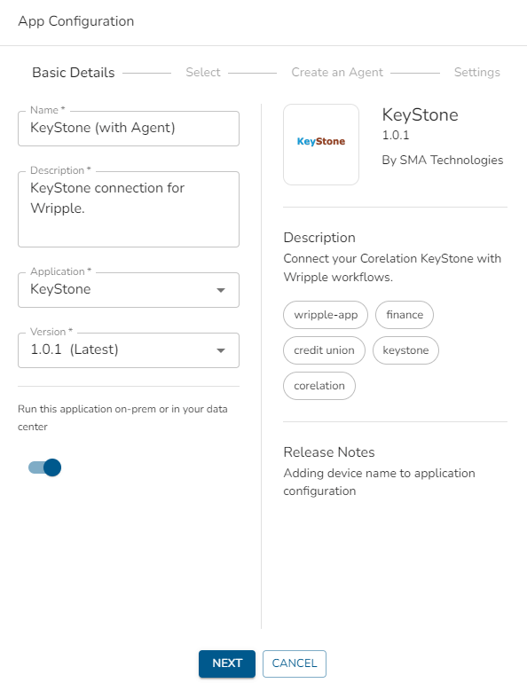
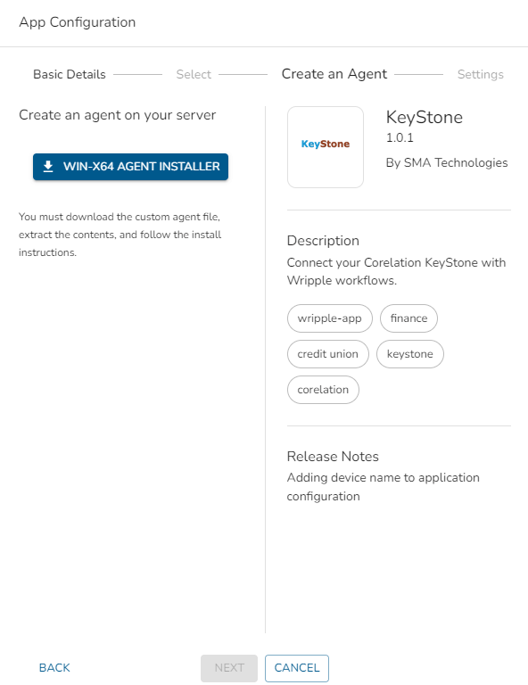
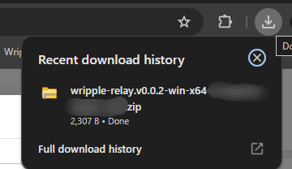

# Wripple Relay

Wripple Relay serves as a secure solution for connecting on-premise applications to Wripple, when direct access via open ports or IP whitelisting is not feasible. Below are the key details about Wripple Relay:

**On-Premise Deployment**: Install Wripple Relay within your data center to securely link your applications with Wripple. Maintain strict control over data privacy and compliance.

**Efficient Communication**: Wripple Relay seamlessly facilitates communication between your applications and the Wripple API, eliminating the need for open ports or whitelisting.

**Robust Security**: Wripple Relay ensures safe data transmission through encryption and authentication mechanisms.

> Wripple Relay currently supports Windows x64 systems, with additional options planned in the near future.

---

## How to Setup Wripple Relay

1. When creating or editing an app configuration, select the option to "Run this application on-premises or in your data center" and proceed to the next step.

   

2. Click the "Win-X64 Agent Installer" button to create and select the Wripple agent.

   

4. The Wripple agent will be automatically downloaded.

   

   > If the download doesn't start automatically, ensure that your browser isn't blocking it.

5. Extract the downloaded files and open your PowerShell terminal as an administrator.
6. Follow the instructions in the `readme.txt` file provided with the installer to complete the Wripple Relay installation.
7. Check Windows services to verify the status of the Wripple Relay service.
8. Once Wripple Relay is installed, proceed with your app configuration. You're now ready to securely connect your on-premises app to Wripple.

> You can monitor Wripple Relay logs located under `C:\ProgramData\Wripple`.

## Firewall Settings

Wripple Relay utilizes specific ports to establish connections. To ensure successful operation, please allow outbound connections for the following ports.

| Protocol | Ports | Description |
| - | - | - | 
| AMQP  | 5671, 5672 | AMQP with TLS. See [AMQP protocol guide](https://learn.microsoft.com/en-us/azure/service-bus-messaging/service-bus-amqp-protocol-guide) | 
| HTTPS | 443 | This port is used for the Wripple API, AMQP-over-WebSockets, and remote logging (disabled by default, can be opt-in). |
