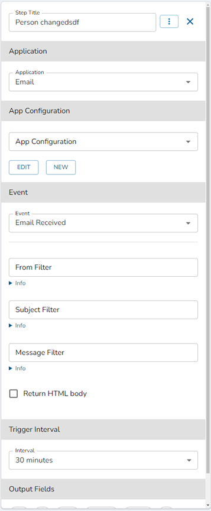

# Workflow Configuration Page

## Required Privileges

In order to access the Workflow Configuration page, you must have one of the the following roles:

- **Reader**: User can view workflow configuration.
- **Editor**: User can view, create, edit, publish, unpublish, lock, unlock their own, and delete the workflow.
- **Admin**: User can view, create, edit, publish, unpublish, lock, unlock all, and delete workflows.

## Edit View

### Adding a Step to the Worfklow

1.  To add a new step to the workflow, click the plus icon on the screen. See image below for an example.

    

1.  After clicking the plus icon, you will be given a choice of adding a new Action, Condition, or For-Each step type. See image below for an exmaple.

    

:::note

Actions - Action steps contain applications, app configurations, and events that can contain input and output fields. The content of each action is unique and specific to the application that is chosen.

Conditions - Condition steps contain logical AND or OR statements that can be used to change the direction of a workflow during execution.

For Each - For Each steps can be used to loop through a list of data that repetitive steps need to be applied to.

:::

### Editing a Step

1.  Click on a step on the screen. See image below for an example.

    

1.  After selecting a step, a right panel will appear with that step containing its information.
1.  By default, the right panel is in view mode. If you want to edit the information, click the edit step button. See image below for an example.

    

1.  The information in the right panel will now be editable. See image below for an example.

    

:::note

All of the changes made will be auto-saved.

:::

### Publishing a Worfklow

1. After the workflow steps have all been filled out, click the 'Publish' button. See image below for an example.

   

:::note

During a publish, Wripple API will validate each step within the workflow, if the steps are all valid, then the workflow will publish. Otherwise the workflow will not publish and the steps must be fixed in order to proceed.

:::

### Other Actions in Edit View

#### Delete Button

In order to delete the workflow, you can click the 'Delete' button. See image below for an example.

#### Summary Button

The summary panel shows what steps are in the workflow. You can filter out steps by typing in the search bar. You can also click the results in this panel to navigate to the step in the workflow view. See image below for an example.

:::note

If you are inside a For Each configuration view, you will only see the steps that the For Each contains in this summary panel. See image below for an example.

:::

#### Revert Changes Button

The revert button will discard all changes in the edit mode and make the workflow the same as the latest published view. See image below for an example.

:::note

If the workflow is not published, you cannot revert.

:::

#### View Published Button

The 'View Published' will navigate you to the latest published version of the workflow you are looking at. In published mode you cannot edit any of the steps inside the workflow. See image below for an example.

:::note

If the workflow has not been published, this button will be disabled.

:::

#### Lock/Unlock Button

Locking a workflow will allow you to prevent others from making changes to the workflow that you locked. To unlock the workflow (so others can edit), click the 'Unlock' button. See images below for an example.

:::note

Users with admin roles have the capability to unlock all workflows including those created by others.

:::

:::note

Editing a workflow will automatically lock it to prevent others from editing.

:::

#### Watch/Un-Watch Button

The watch/un-watch button will enable and disable notifications from triggering for the specific workflow you are viewing. See image below for an example.

#### Execution Statuses Button

The 'Execution Statuses' button will show a recap of all the previously ran executions of the workflow, and the change log associated with each different version published. See image below for an example.

:::note

If the workflow has never been published, the execution statuses will be empty

:::

#### View Settings Button

The 'View Settings' button consists of 3 options to change the way the workflow view functions. See image below for an example.

- **Hide mini-map**: This will show/hide the mini-map in the workflow editor window.
- **Disable animations**: This will enabled/disable animations from happening in the workflow editor window.
- **Align nodes horizontally**: This will change the layout of the steps from vertical to horizontal.

<!-- TODO swap this out -->

## Published View

The published view shows the latest published version of the workflow.

### Unpublishing a workflow

1. Click the 'Unpublish' button
1. Click the 'Confirm' button to proceed with unpublishing the workflow.

### Switching to Edit mode

1. Click the 'Edit' button

### Other Actions in Published View

- The 'Summary' panel is also viewable in published mode and can be read about [here](#summary-button).

- The 'View Settings' is also viewable in published mode and can be read about [here](#view-settings-button).
