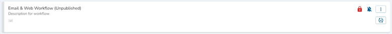
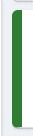
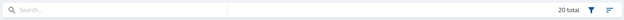
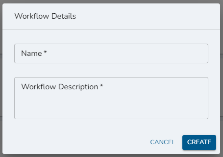
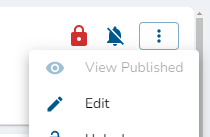
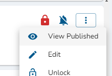
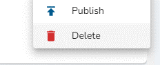

# Workflows Page

## Required Privileges

In order to access the Workflows page, you must have one of the following roles:

- **Reader**: User can view workflows.
- **Editor**: User can view, create, edit, publish, unpublish, lock, unlock their own, and delete workflows.
- **Admin**: User can view, create, edit, publish, unpublish, lock, unlock all, and delete workflows.

## Viewing Workflows

### Workflow Cards

All previously created workflows will be visible as the main content of the page. The below image is an example of a workflow card.

:::tip Whats on the Workflow Card?

- Workflow name.
- Workflow description.
- Icons indicating which applications are used in the workflow.
- Locked/Unlocked status.
- Notification status.
- Workflow Execution History status button.
- Workflow menu button.
  :::

:::tip Published Status
If the workflow is published, the edge of the workflow card will be green indicating it is active. See the below image for an example.

:::

### Filtering & Sorting Workflow Cards

To filter out the workflow cards, you can simply type in the search bar or use the provided filters by clicking on the filters icon. To sort the workflow cards, you can click the sort icon. See the below image for an example.

## Creating Workflows

1.  To create a workflow, click the 'Create' button and you will be prompted with a dialog to fill out the workflow name and description.
1.  Fill out the name and description fields.
1.  Click the 'Create' button within the dialog.
1.  You will now be redirected to the Workflow Configuration page. See the below image for an example.

:::note

Workflow name must be unique.

:::

## Editing and Viewing Workflows

### Editing a Workflow

To edit a workflow, click the menu icon inside the workflow card and click the 'Edit' menu option. See the below image for an example.

### Viewing a Published Workflow

To view a published workflow, click the menu icon inside the workflow card and click the 'View Published' menu option. See the below image for an example.

:::note

If a workflow has not been published, this menu option will be disabled.

:::

## Deleting Workflows

To delete a workflow, click the menu icon inside the workflow card and click the 'Delete' menu option. See the below image for an example.

:::note

If the workflow is currently published, the workflow cannot be deleted. You must first unpublish the workflow inorder to delete the workflow.

:::
