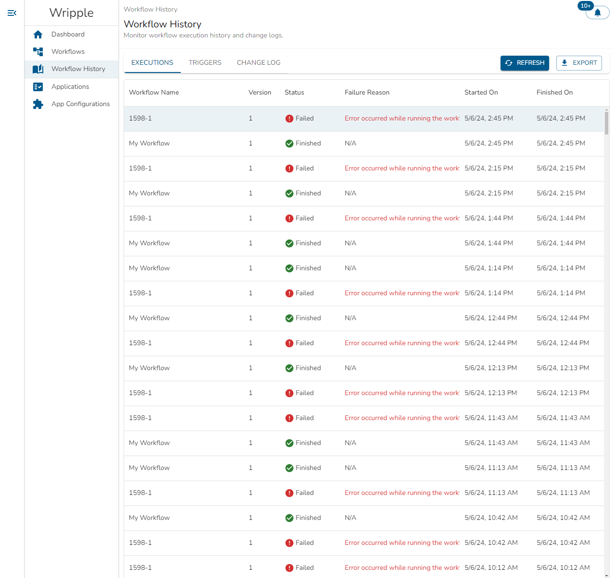
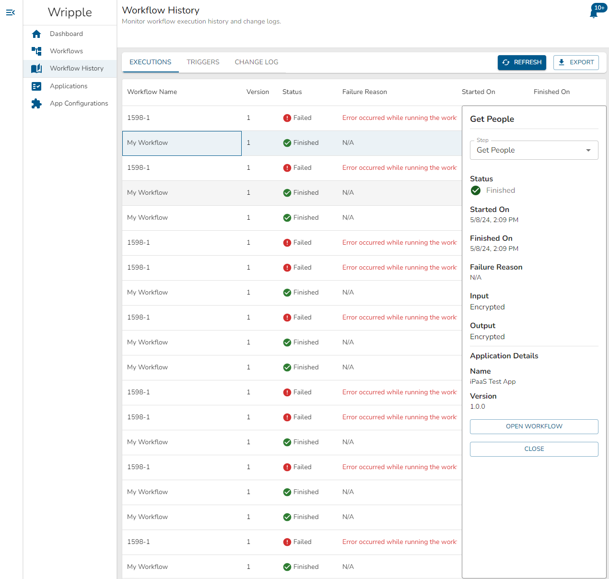

# Execution History
## Execution History Table

The Executions tab of the Workflow History screen allows you to review execution history for all of your workflows.
An example view of this screen can be seen below:

In this table, you can see the following information for each of your workflow executions:
* The name of the workflow which was executed
* The version of the workflow which was executed
* The current status of the workflow execution. This can take three values:
  * Finished - the workflow successfully ran to completion
  * Failed - the workflow encountered some error condition during execution and did not run to completion
  * Running - the workflow is still actively running and has not yet completed
* The reason for the workflow's failure, if applicable
* The time at which the workflow began execution
* The time at which the workflow finished execution, if applicable

Using the buttons located in the upper right corner of this screen, you can:
* `Refresh` the display to update the view and display the most recent workflow executions.
* `Export` this data to download it in the comma-separated values (`.csv`) format for usage in a spreadsheet editor or other software of your choice.

## Execution Details

You can select a row in the Execution History table to examine details of that specific execution in more depth.
Doing so will open a panel on the right-hand side of your screen which will look something like the below:

This panel allows you to examine details of the workflow execution step-by-step.
The `Step` drop-down selector at the top of the panel allows you to choose the step to examine in detail.
Below that selector, you can see the following information for the chosen step:
* The status of the step - as with the workflow, this can take three values:
  * Finished - the step has finished processing
  * Failed - the step encountered some error condition and was unable to complete successfully
  * Running - the step is currently being processed
* The time at which the step began execution
* The time at which the step finished execution, if applicable
* The reason that the step failed to execute, if applicable
* The input values for the step. This field will always display as "Encrypted".
* The output values from the step. This field will always display as "Encrypted".
* The name and version of the Application used in the step.

In addition to this information, you can also use the two buttons on the bottom of the panel to:
* `Open Workflow` in order to navigate to the workflow configuration corresponding to the selected workflow execution.
* `Close` in order to close the side panel.