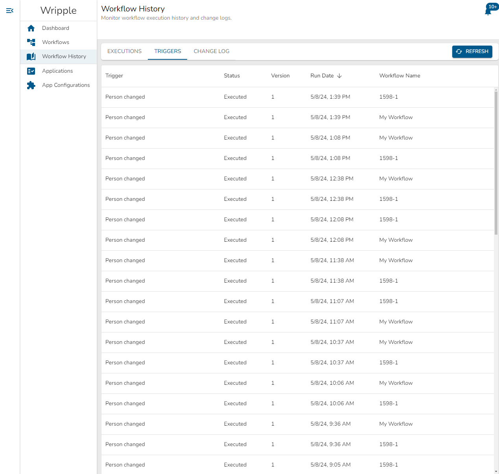

# Trigger History

The Triggers tab of the Workflow History screen allows you to review evaluation history for all of your workflow triggers.
An example view of this screen can be seen below:

In this table, you can see the following information for each of your workflow executions:
* The name of the trigger which was processed
* The status of the workflow which was processed. This can take two values:
  * Executed - The trigger met its criteria and was executed, kicking off a workflow.
  * Skipped - The trigger did not meet its criteria and was not executed. No workflows were started.
* The version of the application associated with the processed trigger
* The date and time that the trigger was processed
* The name of the workflow associated with the processed trigger

Using the `Refresh` button located in the upper right corner of this screen, you can update the view and display the most recent trigger evaluations.