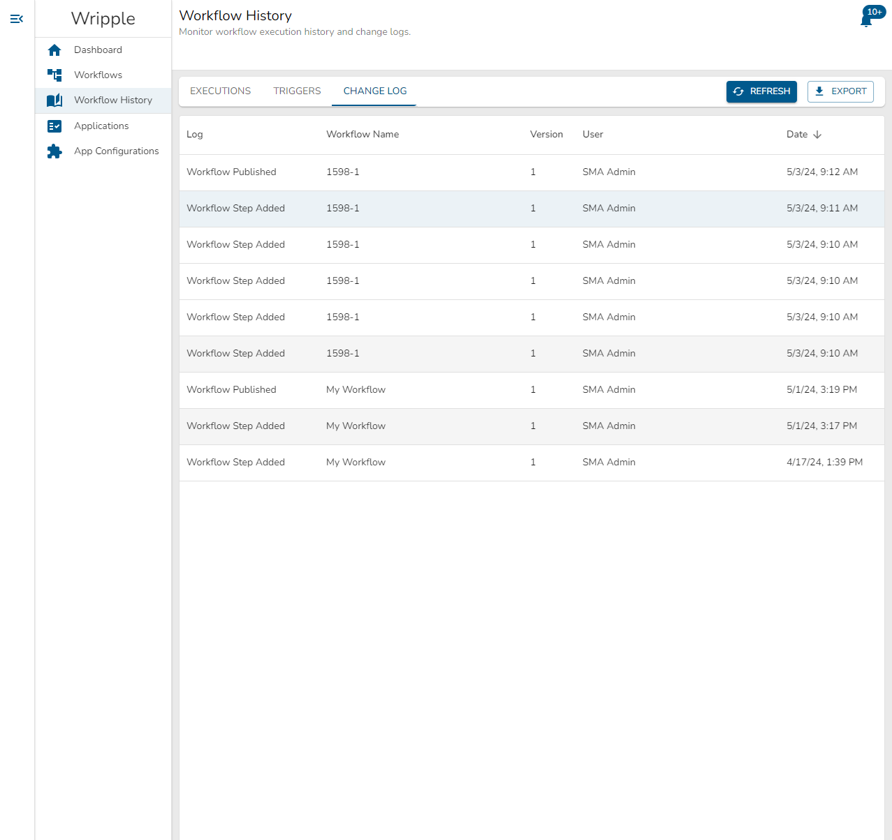
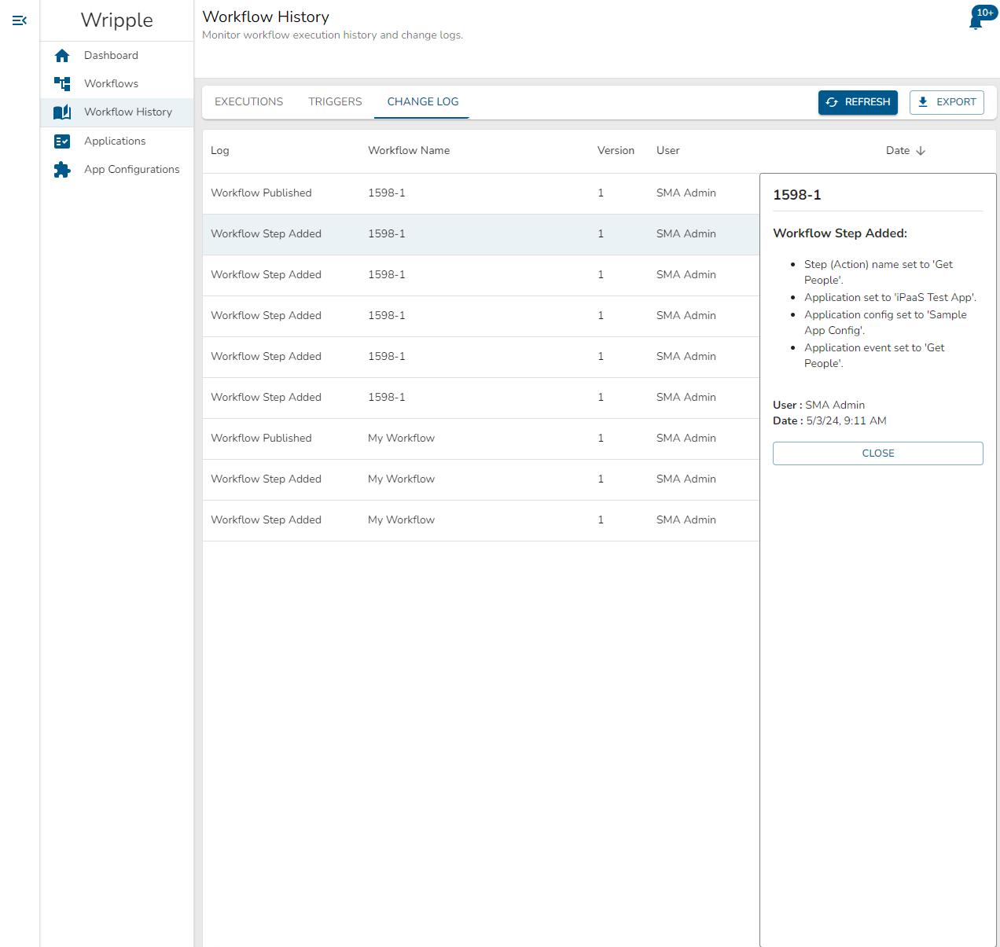

# Change Logs
## Change Log Table

The Change Log tab of the Workflow History screen allows you to review changes made to any of your workflows.
An example view of this screen can be seen below:

In this table, you can see the following information about each change made to a workflow:
* The type of change that was made. This can take seven values:
  * Workflow Step Added
  * Workflow Step Removed
  * Workflow Step Changed
  * Workflow Published
  * Workflow Unpublished
  * Workflow Reverted
  * Workflow Deleted
* The name of the workflow which was changed
* The version of the workflow which was changed
* The user who made the change to the workflow
* The date that the change was made

Using the buttons located in the upper right corner of this screen, you can:
* `Refresh` the display to update the view and display the most recent changes.
* `Export` this data to download it in the comma-separated values (`.csv`) format for usage in a spreadsheet editor or other software of your choice.

## Change Details

You can select a row in the Change Log table to examine details of that specific change in more depth.
Doing so will open a panel on the right-hand side of your screen which will look something like the below:

The contents of this panel will vary depending on the type of change which you are examining, but it will always follow the following structure:
1. The name of the workflow which was changed
1. The type of change which was made
1. A bullet-pointed list of specific changes which were applied as part of the overall change. For example, the details for a 'Workflow Step Changed' record will have a list of step fields and valules that were changed,.
1. The user who made the change
1. The date that the change was made

At the bottom of this panel, the `Close` button will close this panel.