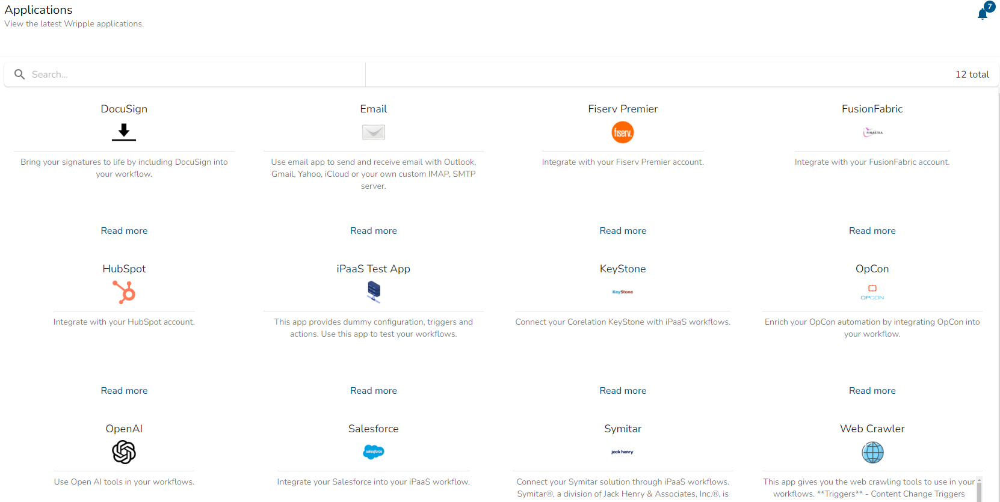
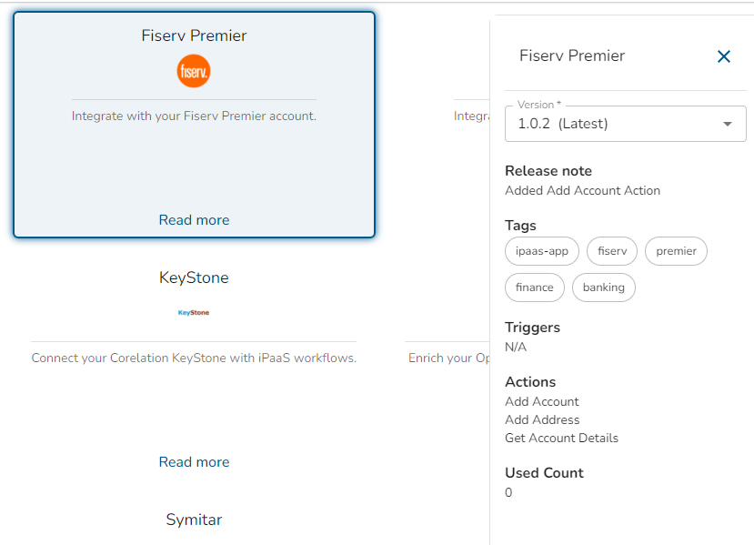

# Applications Page

This page provides an overview of the available applications and their configurations.

## Application List

The Applications page is designed to provide you with a comprehensive collection of tools and integrations that can streamline your workflow. Each card represents a specific application that you can learn more about or integrate into your environment.

### Card Structure

Each application card generally includes:

- **Title:** The name of the application.
- **Icon/Logo:** A recognizable icon or logo of the application.
- **Description:** A brief description that highlights the key features of the application.
- **Action Link:** A **Read more** link that directs you to further details and the option to integrate the app.

## Tips for Efficient Use

- **Stay Updated:** The collection of applications may update periodically, so check back regularly for new and exciting integrations.

## Application Details Drawer

After clicking **Read more** on application card, a right-side drawer displays detailed information about that application.

### Example Details

1. **Version:** Select the version of the application to configure or manage.
2. **Release Note:** A brief description of recent updates or changes in the selected version.
3. **Tags:** Keywords associated with the application for easier identification and searching.
4. **Triggers:** List of triggers available for the application.
5. **Actions:** Available actions to perform with this application, like "Add Account" or "Get Account Details."
6. **Used Count:** Displays how many times this application has been used.
